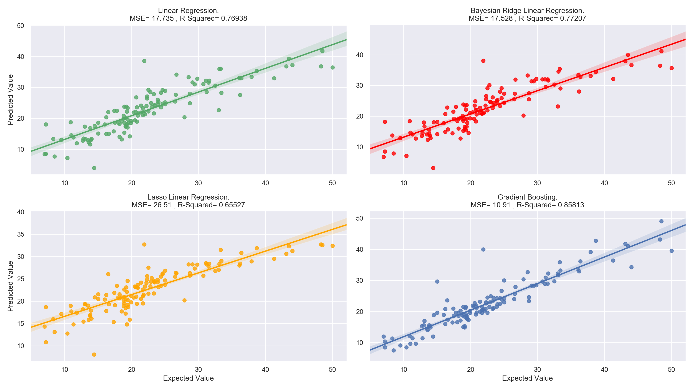

# cebd-1160: Boston Housing Data
Final Project.

| Name | Date |
|:-------|:---------------|
| Arwa Sheraky | 22-3-2019 |

-----

### Resources
This repository includes:

- Python script for boston-housing-data analysis: `python_boston.py`
- Results figures: `Figures/`
- Dockerfile for experiment: `Dockerfile`
- runtime-instructions: `RUNME.md`

-----

## Research Question
Knowing the average prices of houses in suburbs of Boston from the 1970 and the features that could affect them, could we predict the average prices of new houses, having these 13 features?

### Abstract

- opportunity (what data do we have)
- challenge (what is the "problem" we could solve with this dataset)
- action (how will we try to solve this problem/answer this question)
- resolution (what did we end up producing)

### Introduction
The dataset used in this project, is publically shared on scikit-learn [datasets](https://scikit-learn.org/stable/datasets/index.html#boston-dataset), which could be explicitly imported into any python app, from `sklearn` library.

### Methods

By applying different regressors, comparing their performance and [RMSE](https://www.statisticshowto.datasciencecentral.com/rmse/), **Gradient Boosting Regressor** was the best one to solve the problem and predict the average prices as close to the real values as possible.

Gradient Boosting Regressor, and all the other used regressors too, is built-into scikit-learn. Algorithm of the regressor can be found [here](https://en.wikipedia.org/wiki/Gradient_boosting#Algorithm), and how the regressor works on python is on scikit-learn documentation: [`sklearn.ensemble.GradientBoostingRegressor`](https://scikit-learn.org/stable/modules/generated/sklearn.ensemble.GradientBoostingRegressor.html#sklearn.ensemble.GradientBoostingRegressor).

### Results

Brief (2 paragraph) description about your results. Include:

- At least 1 figure
- At least 1 "value" that summarizes either your data or the "performance" of your method
- A short explanation of both of the above

### Discussion
Brief (no more than 1-2 paragraph) description about what you did. Include:

- interpretation of whether your method "solved" the problem
- suggested next step that could make it better.

### References
All of the links

-------
